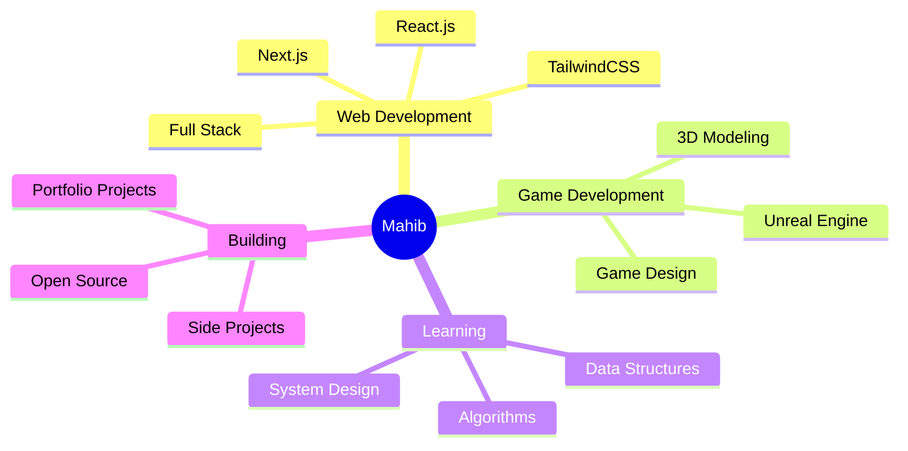

<div align="center">
  
#  Hey, I'm Mahib!


</div>

<br>


### 👨‍💻 About Me

```yaml
name: Mahib
located_in: Dhaka, Bangladesh
current_study: Computer Science & Engineering
university: Daffodil International University
interests:
  - Web Development
  - Game Development
  - Learning Modern Tech Stack
  - Building Portfolio Projects

motto: "Challenging myself to grow beyond my comfort zone"
```

<br clear="both">

---

<div align="center">

## 🌐 Let's Connect

[](https://www.facebook.com/sadman.mahib/)
[](https://www.instagram.com/mahib.zip/)
[](https://discord.com/users/mahib0740)
[](#)
[](#)

</div>

---

<div align="center">

## 🛠️ Tech Arsenal

### Programming Languages

<p>
  
  
  
  
</p>

### Web Technologies

<p>
  
  
  
</p>

### Tools & Platforms

<p>
  
  
  
  
</p>

### Gaming & Entertainment

<p>
  
  
  
  
</p>

</div>

---

<div align="center">

## 📊 GitHub Stats


### 🏆 GitHub Trophies


### 📈 Most Used Languages


</div>

---

<div align="center">

## 🎯 Current Focus



</div>

---

<div align="center">

## 💭 Random Dev Quote


</div>

<div align="center">

### 👀 Profile Views


</div>

---

<div align="center">
  
</div>
